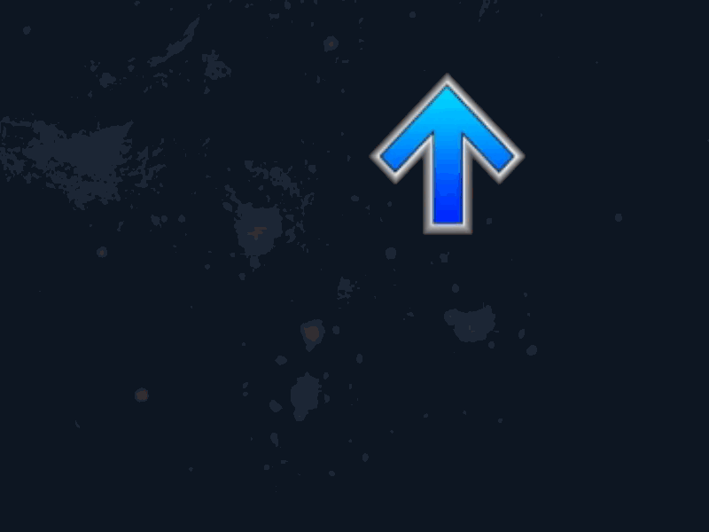

The `NoteOrigin` class manages the origin point for notes within a storyboard. It controls the positioning, scaling, and rotation of these origins, supporting animations and transitions that sync with gameplay.

## Properties

- `receptorSpritePath`: `string` - Path to the sprite image used for the note origin.
- `layer`: `StoryboardLayer` - The storyboard layer where the note origin is rendered.
- `originSprite`: `OsbSprite` - The sprite object representing the note origin.
- `positionX`, `positionY`: `SortedDictionary<double, float>` - Dictionaries tracking the X and Y positions of the origin over time.
- `bpmOffset`, `bpm`: `double` - BPM and its offset for precise timing.
- `debug`: `OsbSprite` - A sprite used for debugging and testing purposes.
- `rotation`: `double` - Current rotation of the note origin in radians.
- `deltaIncrement`: `double` - Incremental value used for detailed easing calculations.

## Initialization

Initializes a new instance of the `NoteOrigin` with specified properties and setups up initial animations.

```csharp
public NoteOrigin(string receptorSpritePath, double rotation, StoryboardLayer layer, CommandScale scale, double starttime, double delta);
```

**Parameters:**
- `receptorSpritePath` (`string`): Path to the sprite image.
- `rotation` (`double`): Initial rotation in radians.
- `layer` (`StoryboardLayer`): The storyboard layer for rendering.
- `scale` (`CommandScale`): Scaling factor for the sprite.
- `starttime` (`double`): Start time for initial animations.
- `delta` (`double`): Delta increment for easing calculations.

## Methods

### Render
Manages the rendering of the note origin on the storyboard.

```csharp
public void Render(double starttime, double endTime);
```

**Parameters:**
- `starttime` (`double`): Start time for rendering.
- `endTime` (`double`): End time for rendering.

### Movement Methods
Methods for moving the note origin both absolutely and relatively within the storyboard.

```csharp
public void MoveOriginAbsolute(double starttime, Vector2 endPos);
public void MoveOriginAbsolute(OsbEasing ease, double starttime, double endtime, Vector2 startPos, Vector2 endPos);
public void MoveOriginRelative(OsbEasing ease, double starttime, double endtime, Vector2 offset);
public void MoveOriginRelativeX(OsbEasing ease, double starttime, double endtime, float value);
public void MoveOriginRelativeY(OsbEasing ease, double starttime, double endtime, float value);
```

**Parameters:**
- `starttime`, `endtime` (`double`): Start and end times for the movement.
- `ease` (`OsbEasing`): Easing function for the transition.
- `startPos`, `endPos`, `offset` (`Vector2`): Starting, ending, and offset positions for the movement.
- `value` (`float`): Value for relative movement in X or Y direction.

### Scale and Rotate
Adjusts the scale and rotation of the note origin to enhance visual effects.

```csharp
public void ScaleReceptor(OsbEasing ease, double starttime, double endtime, Vector2 newScale);
public void RotateReceptor(OsbEasing ease, double starttime, double endtime, double rotation);
public void PivotOrigin(OsbEasing ease, double starttime, double endtime, double rotation, Vector2 center);
```

**Parameters:**
- `ease` (`OsbEasing`): Easing function for the transition.
- `starttime`, `endtime` (`double`): Start and end times for the effect.
- `newScale` (`Vector2`): New scale vector.
- `rotation` (`double`): Rotation angle in radians.
- `center` (`Vector2`): Center point for rotation.

### Utility Methods
These methods provide real-time information about the position, scale, and rotation of the note origin.

```csharp
public Vector2 PositionAt(double time);
public Vector2 ScaleAt(double time);
public float RotationAt(double time);
```

**Parameters:**
- `time` (`double`): The specific time to retrieve the property.

**Returns:**
- Position, scale, or rotation at the specified time.

These utility methods are vital for managing the dynamic movement and appearance of note origins, ensuring they align with the game's rhythm and enhance player interaction.