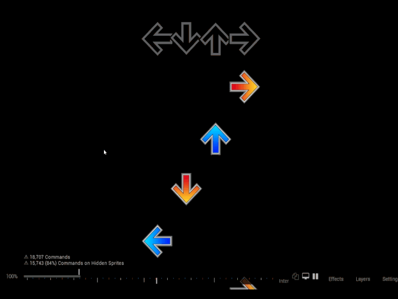
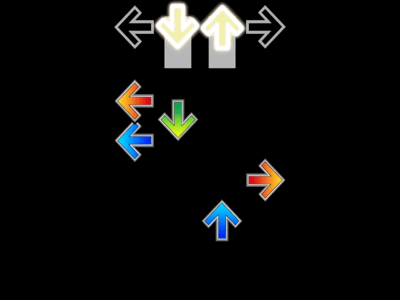

The `Playfield` class primarily handles the visual elements of the game, including receptors, notes, and their animations. It offers a range of functions to manipulate these elements, such as moving, scaling, rotating, and adding effects.

## Properties

- `delta`: Represents the time difference for animations.
- `absoluteWidth`, `width`, `height`: Define the size of the playfield.
- `receptorWallOffset`: Offset for the receptor from the wall.
- `rotation`: Controls the rotation of elements in the playfield.
- `isColored`: Indicates if the notes should be colored.
- `starttime`, `endtime`: Define the time range for the playfield's activity.
- `noteStart`, `noteEnd`: Time range specifically for notes.
- `noteLayer`, `receptorLayer`: Storyboard layers for notes and receptors.
- `columns`: Dictionary mapping column types to their respective column objects.
- `effectReferenceByStartTime`: Stores effects by their start time.
- `columnNotes`: Maps notes to their respective columns and times.
- `fadeAtTime`: Manages fade effects at specific times.

## Initialization

- `InitializePlayField()`: Sets up the playfield with specified dimensions, time range, and layers.
- `InitializeNotes()`: Initializes notes based on given OsuHitObjects, BPM, and offset.

### InitializePlayField
Sets up the playfield with initial dimensions, layers, and columns.

```csharp
public void InitializePlayField(StoryboardLayer receptors, StoryboardLayer notes, double starttime, double endtime, float initialWidth, float initialHeight, float receptorWallOffset, double OverallDifficulty);
```

**Parameters:**
- `receptors` (`StoryboardLayer`): The layer for receptors.
- `notes` (`StoryboardLayer`): The layer for notes.
- `starttime` (`double`): The start time for the playfield's activity.
- `endtime` (`double`): The end time for the playfield's activity.
- `initialWidth` (`float`): Initial width of the playfield.
- `initialHeight` (`float`): Initial height of the playfield.
- `receptorWallOffset` (`float`): Offset for placing the receptors on the playfield.
- `OverallDifficulty` (`double`): Overall difficulty setting for the playfield.

Example code:
```csharp
field.initilizePlayField(receptors, notes, starttime, endtime, width, height, receptorWallOffset, Beatmap.OverallDifficulty);
```

## Methods

### SetWidth
Sets the width of the playfield. 

```csharp
public void SetWidth(float width);
```

**Parameters:**
- `width` (`float`): The new width of the playfield.

---

:::note
Receptors/notes will be far apart from each other as you set the width higher such as **750f** as shown here


Lower width such as **100f** less than equal to **0f** will make each receptors/notes close to each other based on how close the value is to **0f**


Negative width will invert/flip the playfield and receptors/notes will be far apart or closer to each other based on the negative value

:::

### SetHeight
Sets the height of the playfield.

```csharp
public void SetHeight(float height);
```

:::note
Notes will scroll faster when setting the height higher.

Lower height will make the note scroll slower.


Negative width will invert/flip the playfield and the scrolling speed will based on the negative value

:::

**Parameters:**
- `height` (`float`): The new height of the playfield.

---

### InitializeNotes
Initializes notes on the playfield based on hit objects and timing details.

```csharp
public void InitializeNotes(List<OsuHitObject> objects, double bpm, double offset, bool isColored = false, double msPerPart = 30);
```

**Parameters:**
- `objects` (`List<OsuHitObject>`): List of hit objects to place as notes.
- `bpm` (`double`): Beats per minute, used to calculate note timing.
- `offset` (`double`): Offset time for notes to sync correctly.
- `isColored` (`bool`): Indicates whether notes should be colored.
- `msPerPart` (`double`): Milliseconds per part for timing granularity.

---

### AddNote
Adds a note to a specific column if it overlaps with the current play time.

```csharp
public void AddNote(Dictionary<double, Note> notes, OsuHitObject hitobject, Column column, double bpm, double offset, bool isColored, double msPerPart);
```

**Parameters:**
- `notes` (`Dictionary<double, Note>`): Dictionary storing notes keyed by start time.
- `hitobject` (`OsuHitObject`): The hit object to be transformed into a note.
- `column` (`Column`): The column in which the note will be placed.
- `bpm` (`double`): Beats per minute, used for timing.
- `offset` (`double`): Offset time for the note.
- `isColored` (`bool`): If true, the note will be colored.
- `msPerPart` (`double`): Milliseconds per part, affecting note timing.

---

### Resize
Dynamically resizes the playfield dimensions over a specified period.

```csharp
public void Resize(OsbEasing easing, double starttime, double endtime, float width, float height);
```

**Parameters:**
- `easing` (`OsbEasing`): The easing type used for the transition.
- `starttime` (`double`): Start time for the resizing effect.
- `endtime` (`double`): End time for the resizing effect.
- `width` (`float`): The new width to transition to.
- `height` (`float`): The new height to transition to.

---

:::note
Example usage of resize with dynamic height of **500f** -> **50f** -> **350f** over time and fixed width.

```csharp
// Assumed that the initial height set on the playfield is 500f
field.Resize(OsbEasing.None, 21726, 23631, width, height - 450f); // 500f - 450f = 50f
field.Resize(OsbEasing.None, 23631, 25536, width, height + 300f); // 50f + 300f = 350f
```

Another example usage but with dynamic width of **250f** -> **210f** -> **390f** over time and fixed height.

```csharp
// Assumed that the initial height set on the playfield is 250f
field.Resize(OsbEasing.None, 21726, 23631, width - 400f, height); // 250f - 400f = -210f
field.Resize(OsbEasing.None, 23631, 25536, width + 600f, height); // -210f + 600f = 390f 
```
:::

### ScaleOrigin
Applies scaling to the origin of specified columns or all columns.

```csharp
public void ScaleOrigin(OsbEasing easing, double starttime, double endtime, Vector2 scale, ColumnType type);
```

**Parameters:**
- `easing` (`OsbEasing`): The easing type used for scaling.
- `starttime` (`double`): Start time for the scaling effect.
- `endtime` (`double`): End time for the scaling effect.
- `scale` (`Vector2`): Scale factors for x and y dimensions.
- `type` (`ColumnType`): The type of columns to scale (specific or all).

---

:::note
Example usage of ScaleOrigin which the scailing only occurs when the notes appear. The scailing of the notes will be changed once they reach the receptors and it's based on the size of the receptor. 

In this example, the note starts at **0.1f** scale then the note will reach its default size that's based on the receptor's size. The same rule applies when it's sets to **2f** later on. 

This effect also applies regardless of what `ColumnType` you set such as setting the effect on the `ColumnType.one` will only be applied to the `Left Arrow`


```csharp
field.ScaleOrigin(OsbEasing.None, 21726, 22203, new Vector2(0.1f), ColumnType.all);
field.ScaleOrigin(OsbEasing.None, 23631, 23949, new Vector2(2f), ColumnType.all);
```
To learn more about the NoteOrigin, you can go to [this page](/playfield/origin/origin/).
:::

### ScaleReceptor
Applies scaling to the receptors of specified columns or all columns.

```csharp
public void ScaleReceptor(OsbEasing easing, double starttime, double endtime, Vector2 scale, ColumnType type);
```


**Parameters:**
- `easing` (`OsbEasing`): The easing type used for scaling.
- `starttime` (`double`): Start time for the scaling effect.
- `endtime` (`double`): End time for the scaling effect.
- `scale` (`Vector2`): Scale factors for x and y dimensions.
- `type` (`ColumnType`): The type of columns to scale (specific or all).

---

:::note
This is similar to ScaleOrigin function but instead of effects being applied to the origin, it will be applied to the receptors instead. 

This effect also applies regardless of what `ColumnType` you set such as setting the effect on the `ColumnType.one` will only be applied to the `Left Arrow`


```csharp
field.ScaleReceptor(OsbEasing.None, 21726, 23631, new Vector2(0.1f), ColumnType.all);
field.ScaleReceptor(OsbEasing.None, 23631, 25536, new Vector2(2f), ColumnType.all);
```
:::

### ScaleColumn
Applies scaling to both the receptors and origins of specified columns or all columns.

```csharp
public void ScaleColumn(OsbEasing easing, double starttime, double endtime, Vector2 scale, ColumnType type);
```

**Parameters:**
- `easing` (`OsbEasing`): The easing type used for the transition.
- `starttime` (`double`): Start time for the scaling effect.
- `endtime` (`double`): End time for the scaling effect.
- `scale` (`Vector2`): The scale factors for the x and y dimensions.
- `type` (`ColumnType`): Specifies the columns to be scaled (individual column or all columns).

---

:::note
This is a combination of `ScaleOrigin` and `ScaleReceptor` functions.

This effect also applies regardless of what `ColumnType` you set such as setting the effect on the `ColumnType.one` will only be applied to the `Left Arrow`


```csharp
field.ScaleColumn(OsbEasing.None, 21726, 23631, new Vector2(0.1f), ColumnType.all);
field.ScaleColumn(OsbEasing.None, 23631, 25536, new Vector2(2f), ColumnType.all);
```
:::

### MoveColumnRelative
Moves specified columns or all columns relative to their current positions by a given offset.

```csharp
public void MoveColumnRelative(OsbEasing easing, double starttime, double endtime, Vector2 offset, ColumnType type);
```

**Parameters:**
- `easing` (`OsbEasing`): The easing function applied to the movement.
- `starttime` (`double`): The time at which the movement starts.
- `endtime` (`double`): The time at which the movement ends.
- `offset` (`Vector2`): The offset by which the columns are moved.
- `type` (`ColumnType`): Specifies the columns to be moved (individual column or all columns).

---

:::note
For this function, the Vector2's parameters represents x and y values. 

For example, you can move the field on a certain distance on the x-axis by adding positive/negative values. In the snippet below, if the default X of the playfield is 0f, then adding **100f** on the x parameter will make it move to 100f on the x-axis. Thus, the the current X of the playfield is now **100f**

This effect also applies regardless of what `ColumnType` you set such as setting the effect on the `ColumnType.one` will only be applied to the `Left Arrow`


```csharp
field.MoveColumnRelative(OsbEasing.None, 21726, 23631, new Vector2(100f, 50f), ColumnType.all);
field.MoveColumnRelative(OsbEasing.None, 23631, 25536, new Vector2(-150f, -75f), ColumnType.all);
```
:::

### MoveColumnRelativeX
Moves specified columns or all columns relative to their current positions along the X-axis by a specified value.

```csharp
public void MoveColumnRelativeX(OsbEasing easing, double starttime, double endtime, float value, ColumnType type);
```

**Parameters:**
- `easing` (`OsbEasing`): The easing function applied to the movement.
- `starttime` (`double`): The time at which the movement starts.
- `endtime` (`double`): The time at which the movement ends.
- `value` (`float`): The value by which the X-axis position is changed.
- `type` (`ColumnType`): Specifies the columns to be moved (individual column or all columns).

---

:::note
This function makes the playfield moves on the x-axis based on how much value you put in the parameter.

This effect also applies regardless of what `ColumnType` you set such as setting the effect on the `ColumnType.one` will only be applied to the `Left Arrow`


```csharp
field.MoveColumnRelativeX(OsbEasing.None, 21726, 23631, 100f, ColumnType.all);
field.MoveColumnRelativeX(OsbEasing.None, 23631, 25536, -150f, ColumnType.all);
```
:::

### MoveColumnRelativeY
Moves specified columns or all columns relative to their current positions along the Y-axis by a specified value.

```csharp
public void MoveColumnRelativeY(OsbEasing easing, double starttime, double endtime, float value, ColumnType type);
```

**Parameters:**
- `easing` (`OsbEasing`): The easing function applied to the movement.
- `starttime` (`double`): The time at which the movement starts.
- `endtime` (`double`): The time at which the movement ends.
- `value` (`float`): The value by which the Y-axis position is changed.
- `type` (`ColumnType`): Specifies the columns to be moved (individual column or all columns).

---

:::note
This function makes the playfield moves on the y-axis based on how much value you put in the parameter.

This effect also applies regardless of what `ColumnType` you set such as setting the effect on the `ColumnType.one` will only be applied to the `Left Arrow`


```csharp
field.MoveColumnRelativeY(OsbEasing.None, 21726, 23631, 100f, ColumnType.all);
field.MoveColumnRelativeY(OsbEasing.None, 23631, 25536, -125f, ColumnType.all);
```
:::

### Scale
Scales the playfield, optionally keeping the receptors and origins in their relative positions, based on the specified center type.

```csharp
public void Scale(OsbEasing easing, double starttime, double endtime, Vector2 newScale, bool keepPosition = false, CenterType centerType = CenterType.playfield);
```

**Parameters:**
- `easing` (`OsbEasing`): The easing function applied to the scaling.
- `starttime` (`double`): The start time for the scaling.
- `endtime` (`double`): The end time for the scaling.
- `newScale` (`Vector2`): The new scaling factors for x and y dimensions.
- `keepPosition` (`bool`, optional): If true, keeps receptors and origins in their relative positions.
- `centerType` (`CenterType`): Determines the center point for the scaling (playfield, middle, or receptor).

---

:::note
Using this function will alter the size of the playfield based on the Vector2 values. 

The `keepPosition` is set to `false` by default and `CenterType` is set to `playfield` by default also.


```csharp
field.Scale(OsbEasing.None, 21726, 23631, new Vector2(0.1f, 0.1f), false, CenterType.playfield);
field.Scale(OsbEasing.None, 23631, 25536, new Vector2(0.5f, 0.5f), false, CenterType.playfield);
```

Setting the `keepPosition` to `true` will not affect the position of the receptor and the notes itself. It's pretty much like using `ScaleColumn` function and this effect will be the same regardless of the `CenterType`.


```csharp
field.Scale(OsbEasing.None, 21726, 23631, new Vector2(0.1f, 0.1f), true, CenterType.playfield);
field.Scale(OsbEasing.None, 23631, 25536, new Vector2(0.5f, 0.5f), true, CenterType.playfield);
```

This is similar to the effect wherein the `CenterType` is `playfield` but this time, it will alter its playfield size based on the position origin of the screen which is `(320,240)`

```csharp
field.Scale(OsbEasing.None, 21726, 23631, new Vector2(0.1f, 0.1f), false, CenterType.middle);
field.Scale(OsbEasing.None, 23631, 25536, new Vector2(0.5f, 0.5f), false, CenterType.middle);
```

This is similar to the effect wherein the `CenterType` is `middle` but this time, it will alter its playfield size based on how close the receptors are to the middle of the screen (x: 320).

```csharp
field.Scale(OsbEasing.None, 21726, 23631, new Vector2(0.1f, 0.1f), false, CenterType.receptor);
field.Scale(OsbEasing.None, 23631, 25536, new Vector2(0.5f, 0.5f), false, CenterType.receptor);
```
:::

### MoveReceptorAbsolute
Moves a receptor or all receptors from a specific start position to an end position over time.

```csharp
public void MoveReceptorAbsolute(OsbEasing easing, double starttime, double endtime, Vector2 from, Vector2 to, ColumnType column);
```

**Parameters:**
- `easing` (`OsbEasing`): The easing function applied to the movement.
- `starttime` (`double`): The start time for the movement.
- `endtime` (`double`): The end time for the movement.
- `from` (`Vector2`): The starting position of the receptor.
- `to` (`Vector2`): The ending position of the receptor.
- `column` (`ColumnType`): Specifies the column(s) affected (individual or all).

---

:::note
This will only move the receptors while the origin remains the same. 

This effect also applies regardless of what `ColumnType` you set such as setting the effect on the `ColumnType.one` will only be applied to the `Left Arrow`


```csharp
field.MoveReceptorAbsolute(OsbEasing.None, 21726, 23631, new Vector2(-100f, 0f), new Vector2(0.5f, 100f), ColumnType.all);
field.MoveReceptorAbsolute(OsbEasing.None, 23631, 25536, new Vector2(0f, -100f), new Vector2(100f, 0f), ColumnType.all);
```
:::

### MoveReceptorAbsolute (Overloaded)
Moves a receptor or all receptors to a new position from their current positions at a given start time.

```csharp
public void MoveReceptorAbsolute(OsbEasing easing, double starttime, double endtime, Vector2 to, ColumnType column);
```

**Parameters:**
- `easing` (`OsbEasing`): The easing function applied to the movement.
- `starttime` (`double`): The start time for the movement.
- `endtime` (`double`): The end time for the movement.
- `to` (`Vector2`): The new position of the receptor.
- `column` (`ColumnType`): Specifies the column(s) affected (individual or all).

---

:::note
This is the same function as above but this will alter the position of the receptors based on the value and current position of the receptors. 

This effect also applies regardless of what `ColumnType` you set such as setting the effect on the `ColumnType.one` will only be applied to the `Left Arrow`


```csharp
field.MoveReceptorAbsolute(OsbEasing.None, 21726, 23631, new Vector2(0f, 100f), ColumnType.all);
field.MoveReceptorAbsolute(OsbEasing.None, 23631, 25536, new Vector2(100f, 0f), ColumnType.all);
```
:::

### MoveReceptorRelative
Moves a receptor or all receptors by a relative offset over a specified period.

```csharp
public void MoveReceptorRelative(OsbEasing easing, double starttime, double endtime, Vector2 position, ColumnType column);
```

**Parameters:**
- `easing` (`OsbEasing`): The easing function applied to the movement.
- `starttime` (`double`): The start time for the movement.
- `endtime` (`double`): The end time for the movement.
- `position` (`Vector2`): The relative offset by which to move the receptor.
- `column` (`ColumnType`): Specifies the column(s) affected (individual or all).

---

:::note
This has the same effect as the `MoveReceptorAbsolute` but it requires parameters that are the same as `overloaded`
:::

### MoveOriginAbsolute
Moves an origin or all origins to a new position at a specified time.

```csharp
public void MoveOriginAbsolute(double starttime, Vector2 to, ColumnType column);
```

**Parameters:**
- `starttime` (`double`): The time at which the movement starts.
- `to` (`Vector2`): The new position of the origin.
- `column` (`ColumnType`): Specifies the column(s) affected (individual or all).

---

:::note
This effect will move the origin instantly based on the vector2 values.

This effect also applies regardless of what `ColumnType` you set such as setting the effect on the `ColumnType.one` will only be applied to the `Left Arrow`


```csharp
field.MoveOriginAbsolute(21726, new Vector2(100f, 50f), ColumnType.all);
field.MoveOriginAbsolute(23631, new Vector2(-200f, -50f), ColumnType.all);
```
:::

### MoveOriginAbsolute (Eased)
Moves an origin or all origins from their current positions at a given start time to a new position over a specified period, using easing.

```csharp
public void MoveOriginAbsolute(OsbEasing easing, double starttime, double endtime, Vector2 to, ColumnType column);
```

**Parameters:**
- `easing` (`OsbEasing`): The easing function applied to the movement.
- `starttime` (`double`): The start time for the movement.
- `endtime` (`double`): The end time for the movement.
- `to` (`Vector2`): The new position of the origin.
- `column` (`ColumnType`): Specifies the column(s) affected (individual or all).

---

:::note
This effect will move the origin from the current position of the origin to the destination based on the vector2 values with easings.

This effect also applies regardless of what `ColumnType` you set such as setting the effect on the `ColumnType.one` will only be applied to the `Left Arrow`


```csharp
field.MoveOriginAbsolute(OsbEasing.OutCirc, 21726, 23631, new Vector2(100f, 100f), ColumnType.all);
field.MoveOriginAbsolute(OsbEasing.OutCirc, 23631, 25536, new Vector2(450f, 300f), ColumnType.all);
```
:::

### MoveOriginAbsolute (Eased, From-To)
Moves an origin or all origins from a specified start position to an end position over time, using easing.

```csharp
public void MoveOriginAbsolute(OsbEasing easing, double starttime, double endtime, Vector2 from, Vector2 to, ColumnType column);
```

**Parameters:**
- `easing` (`OsbEasing

`): The easing function applied to the movement.
- `starttime` (`double`): The start time for the movement.
- `endtime` (`double`): The end time for the movement.
- `from` (`Vector2`): The starting position of the origin.
- `to` (`Vector2`): The ending position of the origin.
- `column` (`ColumnType`): Specifies the column(s) affected (individual or all).

---

:::note
This effect will move the origin from the source position to the destination based on the vector2 values with easings.

This effect also applies regardless of what `ColumnType` you set such as setting the effect on the `ColumnType.one` will only be applied to the `Left Arrow`


```csharp
field.MoveOriginAbsolute(OsbEasing.OutCirc, 21726, 23631, new Vector2(100f, 100f), new Vector2(250f, 200f), ColumnType.all);
field.MoveOriginAbsolute(OsbEasing.OutCirc, 23631, 25536, new Vector2(450f, 300f), new Vector2(200f, 100f), ColumnType.all);
```
:::

### RotateReceptorRelative
Rotates receptors within specified columns or all columns relative to their current rotation.

```csharp
public void RotateReceptorRelative(OsbEasing easing, double starttime, double endtime, double rotation, ColumnType column = ColumnType.all);
```

**Parameters:**
- `easing` (`OsbEasing`): The easing function applied to the rotation.
- `starttime` (`double`): The time at which the rotation starts.
- `endtime` (`double`): The time at which the rotation ends.
- `rotation` (`double`): The degree of rotation to be applied.
- `column` (`ColumnType`): Specifies the columns to be rotated (individual column or all columns).

---

### RotateReceptorAbsolute
Rotates receptors within specified columns or all columns to a specified angle over time.

```csharp
public void RotateReceptorAbsolute(OsbEasing easing, double starttime, double endtime, double rotation, ColumnType column = ColumnType.all);
```

**Parameters:**
- `easing` (`OsbEasing`): The easing function applied to the rotation.
- `starttime` (`double`): The time at which the rotation starts.
- `endtime` (`double`): The time at which the rotation ends.
- `rotation` (`double`): The absolute degree of rotation to be applied.
- `column` (`ColumnType`): Specifies the columns to be rotated (individual column or all columns).

---

:::note
This effect also applies regardless of what `ColumnType` you set such as setting the effect on the `ColumnType.one` will only be applied to the `Left Arrow`


```csharp
field.RotateReceptorAbsolute(OsbEasing.None, 21726, 23631, Math.PI / 100, ColumnType.all);
field.RotateReceptorAbsolute(OsbEasing.None, 23631, 25536, 50 / Math.PI, ColumnType.all);
```
:::

### RotatePlayFieldStatic
Rotates the entire playfield statically, adjusting the receptors to maintain their relative positions despite the playfield's rotation.

```csharp
public void RotatePlayFieldStatic(OsbEasing easing, double starttime, double endtime, double radians);
```

**Parameters:**
- `easing` (`OsbEasing`): The easing type used for the rotation.
- `starttime` (`double`): The start time for the rotation effect.
- `endtime` (`double`): The end time for the rotation effect.
- `radians` (`double`): The angle in radians to rotate the playfield.

---

:::note

```csharp
field.RotatePlayFieldStatic(OsbEasing.None, 21726, 23631, -50 / Math.PI);
field.RotatePlayFieldStatic(OsbEasing.None, 23631, 25536, 50 / Math.PI);
```
:::

### Rotate
Rotates the entire playfield, dynamically adjusting the positions of receptors to match the new orientation based on a specified center type.

```csharp
public void Rotate(OsbEasing easing, double starttime, double endtime, double radians, CenterType centerType = CenterType.middle);
```

**Parameters:**
- `easing` (`OsbEasing`): The easing type used for the rotation.
- `starttime` (`double`): The start time for the rotation effect.
- `endtime` (`double`): The end time for the rotation effect.
- `radians` (`double`): The angle in radians to rotate the playfield.
- `centerType` (`CenterType`): The center type for the rotation (playfield, middle, or receptor).

---

:::note
`CenterType` = Middle

```csharp
field.Rotate(OsbEasing.None, 21726, 23631, -50 / Math.PI, CenterType.Middle);
field.Rotate(OsbEasing.None, 23631, 25536, 50 / Math.PI, CenterType.Middle);
```
`CenterType` = Receptor

```csharp
field.Rotate(OsbEasing.None, 21726, 23631, -50 / Math.PI, CenterType.Receptor);
field.Rotate(OsbEasing.None, 23631, 25536, 50 / Math.PI, CenterType.Receptor);
```
`CenterType` = Playfield

```csharp
field.Rotate(OsbEasing.None, 21726, 23631, -50 / Math.PI, CenterType.Playfield);
field.Rotate(OsbEasing.None, 23631, 25536, 50 / Math.PI, CenterType.Playfield);
```
:::

### RotateColumn
Rotates a specific column within the playfield, considering different centering options for rotation.

```csharp
public void RotateColumn(OsbEasing easing, double starttime, double endtime, double radians, ColumnType columnType, CenterTypeColumn centerType = CenterTypeColumn.middle);
```

**Parameters:**
- `easing` (`OsbEasing`): The easing type used for the rotation.
- `starttime` (`double`): The start time for the rotation effect.
- `endtime` (`double`): The end time for the rotation effect.
- `radians` (`double`): The angle in radians to rotate the column.
- `columnType` (`ColumnType`): The specific column type to be rotated.
- `centerType` (`CenterTypeColumn`): Specifies the centering type for the rotation (playfield, middle, receptor, column, or columnX).

---

### MoveFieldX
Moves the entire playfield horizontally relative to its current position.

```csharp
public void MoveFieldX(OsbEasing easing, double starttime, double endtime, float amount);
```

**Parameters:**
- `easing` (`OsbEasing`): The easing type used for the movement.
- `starttime` (`double`): The start time for the movement.
- `endtime` (`double`): The end time for the movement.
- `amount` (`float`): The amount by which to move the field along the X-axis.

---

### MoveFieldY
Moves the entire playfield vertically relative to its current position.

```csharp
public void MoveFieldY(OsbEasing easing, double starttime, double endtime, float amount);
```

**Parameters:**
- `easing` (`OsbEasing`): The easing type used for the movement.
- `starttime` (`double`): The start time for the movement.
- `endtime` (`double`): The end time for the movement.
- `amount` (`float`): The amount by which to move the field along the Y-axis.

---

### MoveField
Moves the entire playfield both horizontally and vertically relative to its current position.

```csharp
public void MoveField(OsbEasing easing, double starttime, double endtime, float amountX, float amountY);
```

**Parameters:**
- `easing` (`OsbEasing`): The easing type used for the movement.
- `starttime` (`double`): The start time for the movement.
- `endtime` (`double`): The end time for the movement.
- `amountX` (`float`): The amount by which to move the field along the X-axis.
- `amountY` (`float`): The amount by which to move the field along the Y-axis.

---

### AddEffect
Adds an effect to the playfield at a specific time, specified by the type of effect and a reference.

```csharp
public void AddEffect(double starttime, double endtime, EffectType type, string reference);
```

**Parameters:**
- `starttime` (`double`): The start time when the effect begins.
- `endtime` (`double`): The end time when the effect ends.
- `type` (`EffectType`): The type of effect to be added.
- `reference` (`string`): A reference identifier for the effect.

---

### AddEffectWithValue
Adds an effect with an associated value to the playfield at a specific time, providing additional control over the effect's intensity or behavior.

```csharp
public void AddEffectWithValue(double starttime, double endtime, EffectType type, string reference, float value);
```

**Parameters:**
- `starttime` (`double`): The start time when the effect begins.
- `endtime` (`double`): The end time when the effect ends.
- `type` (`EffectType`): The type of effect to be added.
- `reference` (`string`): A reference identifier for the effect.
- `value` (`float`): A value associated with the effect, adjusting its intensity or other characteristics.

---

### FadeAt
Creates a fade effect at a specific time, using either a single or a range of time.

```csharp
public void FadeAt(double time, float fade);
public void FadeAt(double time, double endtime, float fade);
public void FadeAt(double time, double endtime, OsbEasing easing, float fade);
```

**Parameters:**
- `time` (`double`): The start time for the fade effect.
- `endtime` (`double`, optional): The end time for the fade effect, if specifying a duration.
- `easing` (`OsbEasing`, optional): The easing function applied to the fade effect.
- `fade` (`float`): The target opacity level.

---

### FindFadeAtTime
Finds the fade effect that is active at a given time.

```csharp
public float FindFadeAtTime(double time);
```

**Parameters:**
- `time` (`double`): The time at which to find the active fade effect.

**Returns:**
- (`float`): The opacity level of the fade effect active at the specified time.

---

### GetColumnWidth
Calculates the width of individual columns based on the total width of the playfield.

```csharp
public float GetColumnWidth();
public float GetColumnWidth(float width);
```

**Parameters:**
- `width` (`float`, optional): The width of the playfield, if different from the current width.

**Returns:**
- (`float`): The width of one column.

---

### CalculateOffset
Calculates the offset needed to center the columns within the playfield.

```csharp
public float CalculateOffset();
public float CalculateOffset(float width);
```

**Parameters:**
- `width` (`float`, optional): The width of the playfield, if different from the current width.

**Returns:**
- (`float`): The calculated offset.

---

### CalculatePlayFieldCenter
Calculates the center point of the playfield based on the positions of receptors and origins at a given time.

```csharp
public Vector2 CalculatePlayFieldCenter(double currentTime);
```

**Parameters:**
- `currentTime` (`double`): The time at which to calculate the center.

**Returns:**
- (`Vector2`): The center point of the playfield.