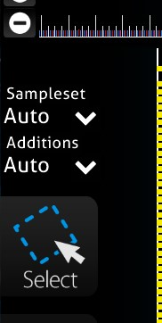

## Getting Started with notOSU!

Welcome to the setup guide for notOSU!, a tool designed for creating dynamic storyboards in osu!mania. This guide will walk you through the process of downloading and configuring notOSU! for your storyboard projects.

### Step 1: Download the Files
Start by downloading the latest release of notOSU! from the [official repository](https://github.com/Tunnelbliick/notosu/releases/latest). Make sure to select the most recent version for the latest features and improvements.

### Step 2: Installation
Once you have downloaded the files, you need to integrate them into your storyboard environment:

- Locate the `/scriptLibrary` directory in your storyboard project.
- Extract and move the downloaded folders from notOSU! into the `/scriptLibrary` directory.

With these steps, the initial setup for notOSU! is complete.

## Configuring a Playfield for Storyboarding

Setting up a playfield and notes in notOSU! involves three key components: layers, a playfield instance, and a DrawInstance. Here's how to do it:

### Required Components:

1. **Layers**: Create separate layers for receptors and notes within your storyboard.
```csharp
    var receptors = GetLayer("r");
    var notes = GetLayer("n");
```
2. **Playfield Instance**: Establish a playfield instance to manage the gameplay area and note mechanics.
```csharp
    Playfield field = new Playfield();
    field.initilizePlayField(receptors, notes, starttime, endtime, width, height, receptorWallOffset, Beatmap.OverallDifficulty);
    field.initializeNotes(Beatmap.HitObjects.ToList(), Beatmap.GetTimingPointAt(starttime).Bpm, Beatmap.GetTimingPointAt(starttime).Offset, isColored, sliderAccuracy);
```
3. **DrawInstance**: Utilize a DrawInstance to control how notes are drawn and animated on the playfield.
```csharp
    DrawInstance draw = new DrawInstance(field, starttime, scrollSpeed, updatesPerSecond, OsbEasing.None, true, fadeTime, fadeTime);
    draw.drawViaEquation(duration, NoteFunction, true);
```

### Example Setup:

Below is an example script to guide you through configuring a playfield in notOSU!:

```csharp
// Generate function in a storybrew script
public override void Generate() {

    var receptors = GetLayer("r");
    var notes = GetLayer("n");

    // General values
    var starttime = 0; // the starttime where the playfield is initialized
    var endtime = 257044; // the endtime where the playfield is nolonger beeing rendered
    var duration = endtime - starttime; // the length the playfield is kept alive

    // Playfield Scale
    var width = 250f; // widht of the playfield / invert to flip
    var height = 600f; // height of the playfield / invert to flip -600 = downscroll | 600 = upscropll
    var receptorWallOffset = 50f; // how big the boundary box for the receptor is 50 means it will be pushed away 50 units from the wall

    // Note initilization Values
    var sliderAccuracy = 30; // The Segment length for sliderbodies since they are rendered in slices 30 is default
    var isColored = false; // This property is used if you want to color the notes by urself for effects. It does not swap if the snap coloring is used.

    // Drawinstance Values
    var updatesPerSecond = 50; // The amount of steps the rendring engine does to render out note and receptor positions
    var scrollSpeed = 900f; // The speed at which the Notes scroll
    var fadeTime = 150; // The time notes will fade in

    Playfield field = new Playfield();
    field.initilizePlayField(receptors, notes, starttime, endtime, width, height, receptorWallOffset, Beatmap.OverallDifficulty);
    field.initializeNotes(Beatmap.HitObjects.ToList(), Beatmap.GetTimingPointAt(starttime).Bpm, Beatmap.GetTimingPointAt(starttime).Offset, isColored, sliderAccuracy);

    DrawInstance draw = new DrawInstance(field, starttime, scrollSpeed, updatesPerSecond, OsbEasing.None, true, fadeTime, fadeTime);
    draw.drawViaEquation(duration, NoteFunction, true);
}

// NoteFunction is used to manipulate the pathway and a bunch of other things the note should do on their way to the receptor
// Please be warry that this is beeing run async so you need to keep thread safety in mind when working on complex Functions.
// You can use the progress to determin how far the note is in its cycle 0 = just start | 1 = ontop of receptor / finished
// Special flags for hold bodies exist
public Vector2 NoteFunction(EquationParameters p)
{
    return p.position;
}
```

When the code above is executed on the storybrew, it will look like this:


### Hitlighting

Notosu! now includes hitlighting via storybpoard triggers. For this you need to set the **Sample Set** and **Additions** per column, **left to right**!


Starting left.
- Column 1 (Left Arrow) = Sampleset Normal **|** Additons Normal
- Column 2 (Down Arrow) = Sampleset Normal **|** Additons Soft
- Column 3 (Up Arrow) = Sampleset Soft **|** Additions Normal
- Column 4 (Right Arrow) = Sampleset Soft **|** Additions Soft

:::tip
To be able to easily set the notes to their respective sampleset and additions. 
You can try to:
1. Decrease the timeline zoom up to the maximum
2. Click and drag the cursor on one column on the playfield until you reach the end of song.
3. Set the Sampleset and additions based on the rules above.

:::


This should automatically make hitlighting work.


By following these steps, you can effectively set up your notOSU! Playfield and Notes, ready for creating engaging storyboards for osu!mania.